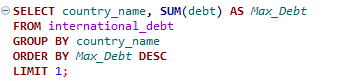
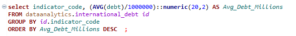
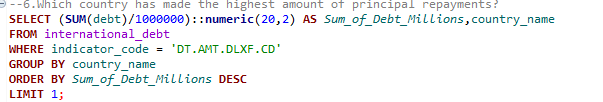
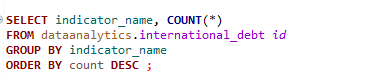
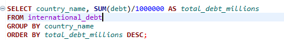

## Countries take on debt not just for necessities but to support economic development. Infrastructure spending, for instance, is a costly yet crucial investment for a country’s progress. The World Bank provides debt financing to developing countries to facilitate such initiatives.

## This project will focus on orecasting international debt trends using World Bank data. The dataset includes information on the total debt (in USD) owed by developing countries across multiple debt categories from 1970 to 2015.

# OBJECTIVES OF THE ANALYSIS:
1. To evaluate the total amount of debt owed by all nations.
To ascertain how much debt each of the nations in the dataset has accrued overall. This will give a global picture of how much debt each country has.

3. Determine the Total Number of Recorded Countries
Determine how many distinct nations are included in the dataset overall. This aids in comprehending the scope and geographic coverage of the data.

4. Examine the Debt Indicators
To recognize and classify the various debt indicator types present in the dataset. This will shed light on the various debt categories that are monitored and their importance.

5. Find Out Which Nation Has the Most Debt
To determine which nation owes the most money overall and assess the

6. Analyze the Mean Debt for All Debt Measures
Calculating and comparing the average debt across various debt indicators . This will make it easier to comprehend the most prevalent debt categories and the resulting financial strain.

7. Examine Principal Repayments
Finding the nation with the largest principal repayments . This will show which countries are actively managing their financial commitments and lowering their debt loads.

8. Find the Most Frequently Used Debt Indicator
Ascertain which debt indicator is most common across nations in order to identify the most common debt type.

9. Recognize the Distribution of Debt by Country
To give a general picture of the debt distribution in different nations. This will assist in examining global debt and determining which nations have the largest debt loads.

 # INTERNATIONAL DEBT REPORT:
 1. All Nation Total Debt Owed
Finding the total debt across all nations is the query here.
The dataset's total debt across all nations comes out to be 3079735.08 million. This is the total debt owing by every nation taken together.

2. count of different nations
Counting the several nations shown in the dataset: query
The dataset thus consists of 124 different nations. This shows the whole coverage of the dataset worldwide.

3. Various Categories of Debt Indicators
Finding the several debt indicator forms applied in the dataset is the query.
The dataset thus includes the following several debt indicators:

- Principal repayments on external debt, private nonguaranteed (PNG) (AMT, current US$)
- PPG, bonds (INT, current US$)
- Interest payments on external debt, long-term (INT, current US$)
- PPG, multilateral (INT, current US$)
- PPG, commercial banks (AMT, current US$)
- PPG, official creditors (AMT, current US$)
- PPG, bonds (AMT, current US$)
- Interest payments on external debt, private nonguaranteed (PNG) (INT, current US$)
- PPG, bilateral (AMT, current US$)
- PPG, private creditors (INT, current US$)
- PPG, other private creditors (DIS, current US$)
- PPG, official creditors (INT, current US$)
- Disbursements on external debt, long-term (DIS, current US$)
- PPG, multilateral (DIS, current US$)
- PPG, bilateral (INT, current US$)
- PPG, official creditors (DIS, current US$)
- Principal repayments on external debt, long-term (AMT, current US$)
- PPG, bilateral (DIS, current US$)
- PPG, private creditors (AMT, current US$)
- PPG, commercial banks (DIS, current US$)
- PPG, other private creditors (INT, current US$)
- PPG, multilateral (AMT, current US$)
- PPG, commercial banks (INT, current US$)
- PPG, private creditors (DIS, current US$)
- PPG, other private creditors (AMT, current US$)] 
These markers show several kinds of debt, including grants, loans, principle payback etc.

4. Country with the Highest Total Debt Question: Determine which nation has the highest total debt.
Result: With a total debt of (285793517568) million, China is the nation with the largest total debt. This illustrates this nation's substantial financial commitments.

5. Average Debt Among Various Debt Measures
Finding the average debt across various debt indicators is the question.
As a result, each indicator's average debt is as follows:

- DT.AMT.DLXF.CD	5904.87
- DT.AMT.DPNG.CD	5161.19
- DT.DIS.DLXF.CD	2152.04
- DT.DIS.OFFT.CD	1958.98
- DT.AMT.PRVT.CD	1803.69
- DT.INT.DLXF.CD	1644.02
- DT.DIS.BLAT.CD	1223.14
- DT.INT.DPNG.CD	1220.41
- DT.AMT.OFFT.CD	1191.19
- DT.AMT.PBND.CD	1082.62
- DT.DIS.MLAT.CD	839.84
- DT.INT.PBND.CD	804.73
- DT.AMT.PROP.CD	746.89
- DT.AMT.PCBK.CD	734.87
- DT.INT.PRVT.CD	719.74
- DT.AMT.BLAT.CD	712.62
- DT.AMT.MLAT.CD	490.06
- DT.DIS.PRVT.CD	311.32
- DT.INT.OFFT.CD	297.68
- DT.DIS.PCBK.CD	293.31
- DT.INT.BLAT.CD	164.09
- DT.INT.PCBK.CD	156.65
- DT.INT.MLAT.CD	136.23
- DT.DIS.PROP.CD	81.14
- DT.INT.PROP.CD	34.25
This sheds light on the most prevalent debt categories and the amount of financial strain each indicator represents.

6. The nation with the largest principal repayment amount
Finding the nation with the largest principal repayments is the question.
Result: With a total repayment of (96218.62) million, China has made the largest principal repayments. This illustrates the nation's resolve to lower its debt.

7. The Most Frequently Used Debt Indicator Worldwide
Finding the most widely used debt indicator worldwide is the question.

As a result:
- PPG, multilateral (INT, current US$)	                             
- Principal repayments on external debt, long-term (AMT, current US$)	 
- Interest payments on external debt, long-term (INT, current US$)	
-  PPG, official creditors (INT, current US$)                	       
- PPG, multilateral (AMT, current US$)	                            
- PPG, official creditors (AMT, current US$)	                             
Which appears 124 times, are the most prevalent debt indicators worldwide.
  

8. The Distribution of Debt in Various Nations
Question: Examining how debt is distributed among various nations.

As a result, the debt is distributed as follows among nations:

[SELECT country_name, SUM(debt)/1000000 AS total_debt_millions
FROM international_debt
GROUP BY country_name
ORDER BY total_debt_millions DESC;] This section illustrates the distribution of debt among nations, making it easier to determine which nations are most indebted. It also sheds light on the disparities in global debt.

